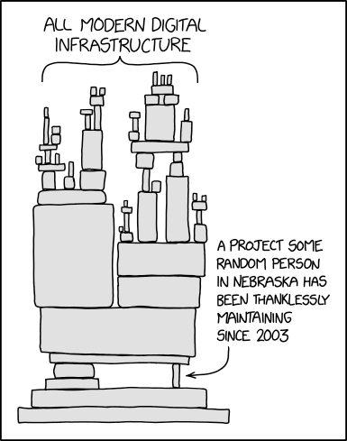

# maven.ketal.icu

A maven repository for my personal projects.

Visit the [`repo`](https://github.com/keta1/maven.ketal.icu/tree/repo) branch to view the content.

Believe me; no one wants to spend time dealing with your **shit**.

So, **Sonatype Fuck You**

Keep in mind, and be careful with every dependency or infrastructure you use.

Always have a plan to get rid of dependency hell.

> **Note** <https://www.explainxkcd.com/wiki/index.php/2347:_Dependency>
